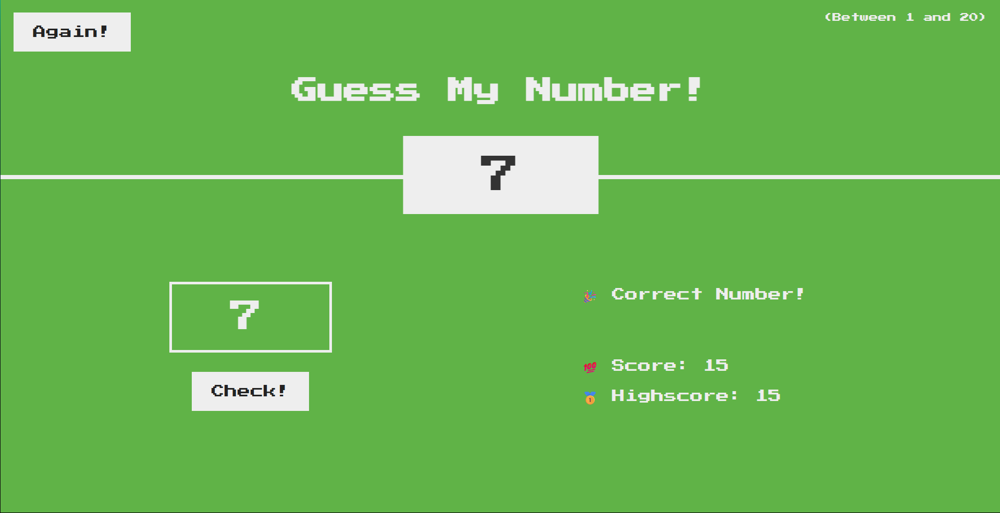

# Guess My Number!

A simple, browser-based number guessing game built with vanilla JavaScript, HTML, and CSS. The player tries to guess a secret number between 1 and 20.

## How to Play

1.  A secret number between 1 and 20 is generated when the page loads.
2.  Enter your guess into the input field.
3.  Click the **"Check!"** button.
4.  Feedback will be provided, indicating if your guess is too high, too low, or correct.
5.  Your score starts at 20 and decreases with every incorrect guess.
6.  If you guess the correct number, the background turns green, and your current score is compared to the highscore.
7.  Click the **"Again!"** button to reset the game and play again with a new secret number.

## Technologies Used

- **HTML5:** For the structure and content of the game.
- **CSS3:** For styling and layout.
- **JavaScript (ES6+):** For all the game logic and DOM manipulation.

## License

This project is licensed under the MIT License - see the [LICENSE](LICENSE) file for details.
